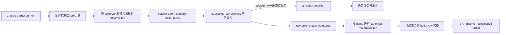

# tom-v2 架构

## 研究定义

tom-v2 预测目标玩家在时间 `t` 的主观狼人怀疑：

```text
公开模型输入：public_history < t + observer_id
一阶私有模型输入：public_history < t + observer_id + K+_observer + K-_observer
输出：B_t(observer, target_player)
```

标签只能由被建模的 playing agent 自己报告，不能由外部模型根据公开信息推断。

## 当前数据主线



同一冻结边界用于所有观察者。collector 只选择公开存活玩家，不接收真实角色标签；每次 query 前后比较 playing agent 状态，任何状态变化都直接失败。说话者的成功报告由冻结对象原样传入紧随其后的 strict day cognition，其他观察者报告仅用于监督；说话者报告失败时不得继续生成该次公开发言。

## 不属于主线的路径

- public-only belief reporter；
- external offline reporter / offline annotation；
- Public Belief Matrix；
- ToM1/ToM2 双任务；
- pair classification 与 21 类狼人组合标签；
- online shadow inference；
- tom-v1 formal reporter 与 pilot pipeline。

Dataset 的公开序列特征始终只来自结构化公开事件。设 `R = known_werewolves - {observer}`，`F = known_non_werewolves ∪ {observer}`：合法 self-report 必须满足 `R ⊆ suspected_werewolves` 且与 `F` 不相交。非空集合只在集合成员上均分；成功空集合是 observed label，target 在六个非自身座位上各为 `1/6`。只有真正 missing/failed 的报告才使用 unobserved zero placeholder 并退出 CE/KL。正式 `observer_supervision_mask` 固定为 `observer_alive_mask & label_observed_mask`；它不读取 role truth，存活且标签可观测的狼人 observer 也在正式 population 中。`diagonal_target_mask` 只排除自身列，死亡玩家仍保留为 target。公开模型不返回 hard knowledge；一阶私有模型与 role-scoped mask 只保留为独立 diagnostics，不进入正式 OOF/final/sealed。

## 模型目标

模型通过结构化公开事件的因果编码和共享 observer query，直接输出
`belief_logits[B, 7, 7]`。第二维对应 observer，第三维对应 target player。
训练损失仅聚合 `observer_alive_mask` 选中的行，并在每行 softmax 前用
`diagonal_target_mask` 排除自身列。公开版本直接使用 observer query；一阶私有版本把 `K+ / K-` 中每个 target 转成 observer-relative seat embedding 并求和，再加入相同的 query。私有 mask 不参与 hard masking 或 label conversion。不存在 21 类组合空间或 pair 投影。

训练时可应用通用座位循环旋转：同一置换同时作用于 observer、target、公开事件中的玩家引用、belief target 的行列以及 mask；验证和 evaluation 不旋转。

正式 dense 训练把同一局所有 snapshot 按 `step_idx` 排序，验证每个 encoded history 都是最终 PRE 序列的精确前缀，然后用 boundary-specific causal mask 输出 `belief_logits[B, Q, 7, 7]`。`Q` 是该局 strict-PRE 边界数，padding boundary 不参与损失；单边界 gameplay inference 仍保持 `belief_logits[B, 7, 7]`。若 256-token 窗口截断破坏精确前缀关系，数据审计和 Dataset 都直接失败，不改写历史或丢弃边界。

模型选择只在原 train+validation 组成的开发集上执行正式 public-only、all-alive 5-fold OOF。每局恰好作为一次 fold validation；原 test 六局不复制进 fold，也不被 OOF 入口读取。报告同时给出逐局模型指标、训练集 global/phase prior、observer-weighted 聚合以及以 game 为重采样单位的 bootstrap CI。在 fixed-state repeatability ceiling 建立前，`0.50` 只作描述性参考值，不是自动通过/失败门槛。Annotation V2、private-conditioned 与 role-scoped OOF 只能通过显式 diagnostic 入口运行，其产物不能作为正式 final-fit epoch selection source。

在 `v1_empty_uniform_nonself` 下，成功的空报告仍是观测到的监督行；只有真实 missing/failed report（或显式 V2 loss mask）可能使某个游戏没有任何监督行。此类游戏保留在 split/OOF 覆盖关系中，但其指标标为未定义并从所有性能分母排除；报告单独公开 scored/unscored game 数与 ID。该规则只是缺失标签语义，不是模型或标签 fallback，且不会放宽全数据无监督时的失败检查。
